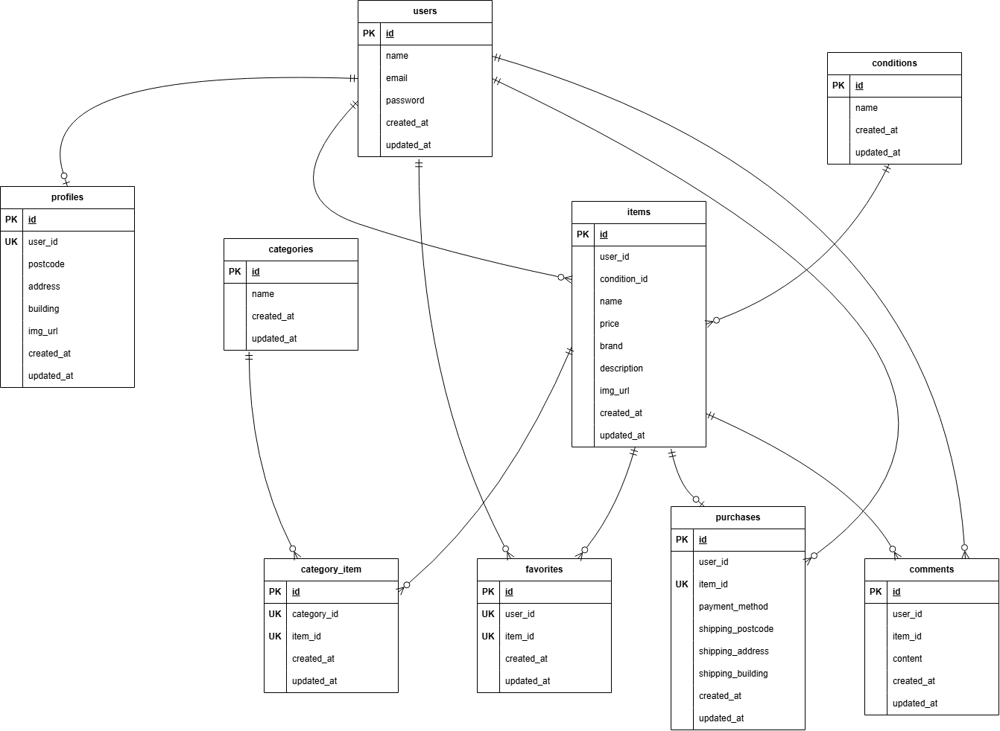

# coachtechフリマ（模擬案件初級\_フリマアプリ）

## プロジェクト概要

10〜30代の社会人をターゲットとした、独自のフリマアプリです。  
ユーザーが手軽にアイテムの「出品」と「購入」を行える環境を提供することを目的として開発しました。

## セットアップ手順

### 1.クローンとビルド

任意のディレクトリでリポジトリをクローンし、プロジェクトディレクトリを作成してコンテナを起動します。

#### 1-1. リポジトリをクローン

```bash
git clone git@github.com:gomashio-no-omusubi/flea-market-app.git
```

#### 1-2. 作成したディレクトリに移動

```bash
cd flea-market-app
```

#### 1-3. DockerDesktopアプリを立ち上げコンテナのビルドと起動

```bash
docker-compose up -d --build
```

_※ コンテナが完全に起動するまで、スペックにより数十秒〜数分かかる場合があります。_

### 2. Laravel環境構築

コンテナ内で以下のコマンドを実行し、アプリをセットアップします。

#### 2-1. コンテナに入る

```bash
docker-compose exec php bash
```

#### 2-2. 依存パッケージのインストール

```bash
composer install
```

#### 2-3. 設定ファイルの準備

```bash
cp .env.example .env
```

#### 2-4. .envファイルの修正

DB接続設定（11行目付近）が以下になっているか確認・修正してください。

```bash
DB_CONNECTION=mysql
DB_HOST=mysql
DB_PORT=3306
DB_DATABASE=laravel_db
DB_USERNAME=laravel_user
DB_PASSWORD=laravel_pass
```

#### 2-5. アプリケーションキーの生成

```bash
php artisan key:generate
```

#### 2-6. マイグレーションの実行

```bash
php artisan migrate
```

#### 2-7. シーディングの実行

```bash
php artisan db:seed
```

## 使用技術(実行環境)

- **PHP** : 8.1.34
- **Laravel** : 8.83.8
- **MySQL** : 8.0.26
- **nginx** : 1.21.1

## ER図



## 開発環境

### アクセスURL

- **商品一覧画面（トップ）** : http://localhost/
- **会員登録画面** : http://localhost/register
- **ログイン画面** : http://localhost/login
- **phpMyAdmin** : http://localhost:8080/
- **MailHog（受信用ダッシュボード）** : http://localhost:8025/

### テスト用ログインアカウント

マイグレーションおよびシーダー（`php artisan db:seed`）の実行後、以下のテスト用アカウントを使用してすぐに各機能の挙動を確認いただけます。
（効率的な動作確認のため、会員登録の手間を省く目的であらかじめ用意しています）

#### 一般ユーザー（購入テスト用）

会員登録なしでログインし、出品されている商品の閲覧・購入の挙動を確認できます。  
※プロフィール画像は、要件である「ローカルからのアップロードおよびストレージ（storageディレクトリ）への保存機能」を実際にテストしていただくため、初期状態では未設定（空）としています。

- **メールアドレス**: `test@example.com`
- **パスワード**: `password`

#### 出品者ユーザー

要件に基づき生成された「商品情報」「商品カテゴリー情報」を持つ、10件のダミー商品を出品しているアカウントです。

- **メールアドレス**: `seller@example.com`
- **パスワード**: `password`

### メール認証機能（FN012・FN013）の確認手順

上記のテスト用アカウントはすべて認証済み状態となっています。  
新規登録時のメール認証や、認証メール再送機能の挙動を確認する際は、以下の手順で行ってください。

1. トップページの「会員登録」から、任意のメールアドレスで新規アカウントを作成する。
2. 登録完了後、自動的にメール認証待ち画面に遷移する。
3. ブラウザで [MailHog](http://localhost:8025/) を開く。
4. 送信された「Verify Email Address（メールアドレスを確認する）」というメールを開き、本文内の認証リンクをクリックする。
5. 認証が完了し、プロフィール設定画面に遷移することを確認する。

_※ `.env` ファイルのメール設定（MAIL_HOST=mailhog, MAIL_PORT=1025 等）は、docker-composeの起動時点で自動的に適用されるようになっています。_
