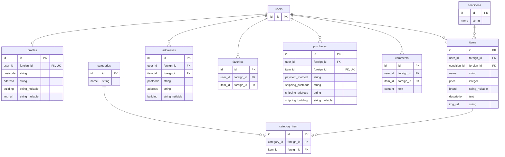

# coachtechフリマ(フリマアプリ)

## セットアップ手順

### 1.クローンとビルド

任意のディレクトリでリポジトリをクローンし、プロジェクトディレクトリを作成してコンテナを起動します。

#### 1. リポジトリをクローン

```bash
git clone git@github.com:gomashio-no-omusubi/flea-market-app.git
```

#### 2. 作成したディレクトリに移動

```bash
cd flea-market-app
```

#### 3. DockerDesktopアプリを立ち上げコンテナのビルドと起動

```bash
docker-compose up -d --build
```

_※ コンテナが完全に起動するまで、スペックにより数十秒〜数分かかる場合があります。_

### 2. Laravel環境構築

コンテナ内で以下のコマンドを実行し、アプリをセットアップします。

#### 1. コンテナに入る

```bash
docker-compose exec php bash
```

#### 2. 依存パッケージのインストール

```bash
composer install
```

#### 3. 設定ファイルの準備

```bash
cp .env.example .env
```

#### 4. .envファイルの修正

DB接続設定（11行目付近）が以下になっているか確認・修正してください。

```bash
DB_CONNECTION=mysql
DB_HOST=mysql
DB_PORT=3306
DB_DATABASE=laravel_db
DB_USERNAME=laravel_user
DB_PASSWORD=laravel_pass
```

#### 5. アプリケーションキーの生成

```bash
php artisan key:generate
```

#### 6. マイグレーションの実行

```bash
php artisan migrate
```

#### 7.　シーディングの実行

```bash
php artisan db:seed
```

## 開発環境

### アクセスURL

- **お問い合わせ画面** : http://localhost/
- **ユーザー登録画面** : http://localhost/register
- **ログイン画面** : http://localhost/login
- **phpMyAdmin** : http://localhost:8080/

### テスト用ログインアカウント

`php artisan db:seed` 実行後、以下のユーザーでログインして動作確認が可能です。
ログインすると、すでに出品済み・購入済みのデータが表示された状態で全機能を確認いただけます。

- **メールアドレス**: `test@example.com`
- **パスワード**: `password`
- **確認ポイント**:ログイン後、商品購入画面にて登録済みの住所（東京都渋谷区...）が配送先として初期表示されます。また、住所変更機能により別の配送先を指定した場合の挙動もご確認いただけます。

## 使用技術(実行環境)

- **PHP** : 8.1.34
- **Laravel** : 8.83.8
- **MySQL** : 8.0.26
- **nginx** : 1.21.1

## ER図

## ER図




